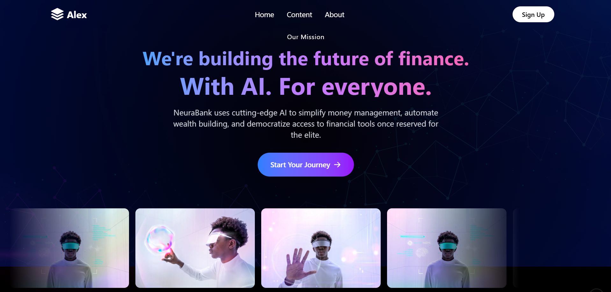

# NeuraBank Components



## Overview
This directory contains the core components of the NeuraBank fintech platform, a modern financial technology solution that combines AI-driven insights with elegant user experience.

## Component Structure

### Core Components
- `Hero.tsx` - Main landing section
- `Feature.tsx` - Feature showcase with animated cards
- `Pricing.tsx` - Pricing plans and packages
- `Testimony.tsx` - User testimonials and statistics
- `Nav.tsx` - Navigation component
- `Footer.tsx` - Site footer with links and information

### UI Components
- `ui/infinite-moving-cards.tsx` - Animated testimonial cards

### Utility Components
- `AOSInit.tsx` - Animate On Scroll initialization
- `BackgroundEffects.tsx` - Animated background gradients

## Features

### 1. Interactive UI Elements
- Responsive design across all device sizes
- Smooth animations and transitions
- Dynamic background effects
- AOS (Animate On Scroll) integration

### 2. Key Features Showcase
- Predictive Wealth Planning
- AI-Powered Insights
- Smart Savings Strategies
- Portfolio Optimization
- Risk Protection
- 24/7 Monitoring
- Real-time Analytics

### 3. Design System
- Consistent gradient patterns
- Modern glassmorphic UI
- Responsive grid layouts
- Interactive hover states
- Dark mode optimization

## Technology Stack
- Next.js
- React
- TypeScript
- Tailwind CSS
- Lucide Icons
- AOS (Animate On Scroll)

## Usage

clone project
```bash
git clone oject
```
Install dependencies
```bash
npm install
```

Run the development server
```bash
npm run dev
```